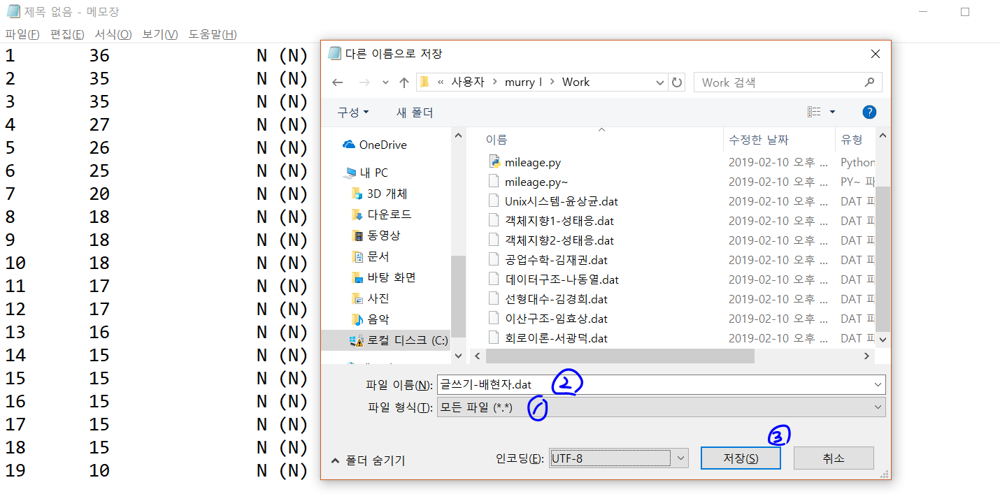

# ytoto-helper
연세토토 베팅 도우미

## Motivation
성공적인 베팅을 위하여

## Version 1 Summary
2019-02-10


### 기능 요약
주어진 마일리지 신청 내역을 이용, 합격자들의 최소, 최대 마일리지 및 마일리지의 중간값, 평균값 계산

### 호환성 가이드
- 파이썬3 스크립트
- 파워쉘의 경우 [filer.py](src/filer.py) 마지막 줄을 다음과 같이 수정
  ```python
	  system("Get-Content {} | python mileage.py".foramt(filename))
  ```
- 비슷하게, 리눅스의 경우:
  ```python
	  system("python3 mileage.py < {}".format(filename))
  ```
- UTF-8 문자를 포함하고 있으므로 3.7 이상의 버전 이용을 권장 (주석 지우면 되긴 함)

### dat 파일 생성 방법
- 파일 이름은 아무거나 가능하지만 과목명을 포함할 것을 권장

1. [수강편람](http://ysweb.yonsei.ac.kr:8888/curri120601/curri_new.jsp#top)에서 원하는 과목의 '마일리지 수강신청 결과'를 조회

   
2. 마일리지 내역 드래그 후 복사

   
3. 메모장에 붙여넣은 후, filer.py와 mileage.py를 내려받은 폴더에
   1. '모든 파일' 선택
   2. 파일 이름이 .dat으로 끝나도록 설정 후
   3. 저장
   
   
4. 실행 결과

   
